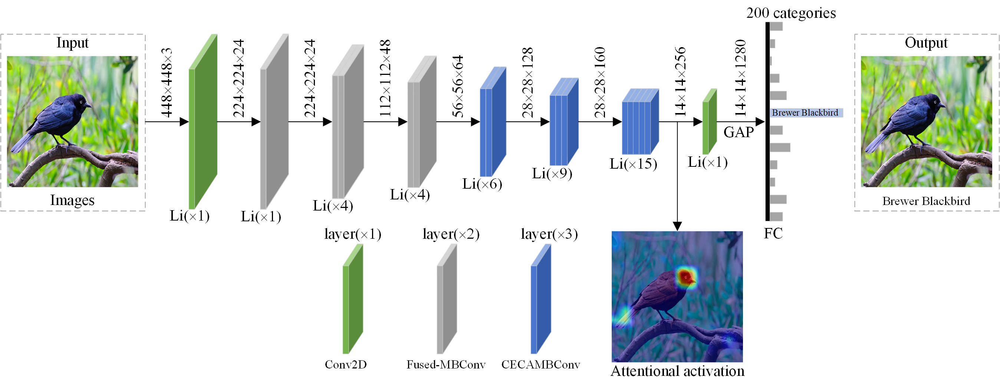

# CMSEA (PyTorch)

## Citing

https://doi.org/10.1109/ACCESS.2022.3150320

### GB/T 7714

Guang J, Liang J. CMSEA: Compound Model Scaling With Efficient Attention for Fine-Grained Image Classification[J]. IEEE Access, 2022, 10: 18222-18232.

### BibTeX

```text
@article{guang2022cmsea,
  title={CMSEA: Compound Model Scaling With Efficient Attention for Fine-Grained Image Classification},
  author={Guang, Jinzheng and Liang, Jianru},
  journal={IEEE Access},
  year={2022},
  volume={10}, 
  pages={18222-18232},
  doi={10.1109/ACCESS.2022.3150320},
  publisher={IEEE}
}
```

## CMSEA Architecture


CMSEA achieves 90.63%, 94.51%, and 95.19% accuracy on CUB-200-2011, FGVC-Aircraft, and Stanford Cars datasets, respectively. In particular, CMSEA on CUB-200-2011 obtains 2.3% higher accuracy with 18% fewer network parameters than the original approach.

## Requirements

```bash
pip install torch>=1.4.0

pip install torchvision>=0.5.0

pip install pyyaml
```
## Start Up
You can run the train.py to train or evaluate as follow:
``` python
python train.py /CaltechBirds-200/ --num-classes 200 --lr 3e-4 --epochs 200 --model tf_efficientnetv2_s
```

## Contact Information
If you have any suggestion or question, you can leave a message here or contact us directly: guangjinzheng@qq.com. Thanks for your attention!

## Acknowledgment
Thanks to [pytorch-image-models](https://github.com/rwightman/pytorch-image-models) and [EfficientNet](https://github.com/google/automl/tree/master/efficientnetv2).
